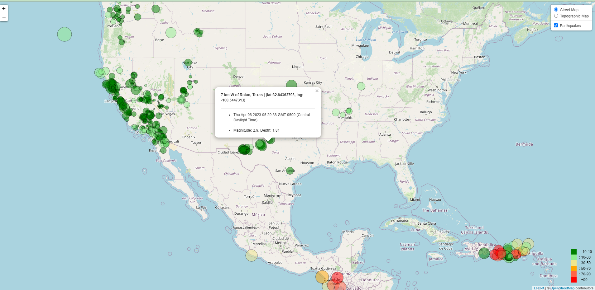

# leaflet-challenge
# Challenge # 15
---

**This repository contains the following:**

A folder called <mark> Part1 </mark> with the code and sources for the visualization:

- logicfinal.js contains the javascript code for the interactive activity
- style.css contains the styles for the data to display
- index.html is the code of the page where the maps are displayed. 
---
---
## First part

Tilelayers were loaded and connected to the geojson API.

Earthquakes data from the site [USGS GeoJson Feed](https://earthquake.usgs.gov/earthquakes/feed/v1.0/geojson.php) were added to the layers.

From these tables the data chosen corresponds to all [Earthquakes in the past 7 days](https://earthquake.usgs.gov/earthquakes/feed/v1.0/summary/all_week.geojson).

Circle markers with size proportional to their magnitude were added. The relation between radius and magnitude is shown below:

Radius of the circle = Magnitude of the earthquake * 20,000   meters

The color of each is based on the depth of the corresponding earthquake in accordance to the following table.

|Meters | Color Scale|
|---| ---|
|-10 to 10 m | Green|
|10 to 30| Light green|
|30 to 50| Khaki|
|50 to 70| Orange|
|70 to 90 | Tomato|
|90 or more| Red|

To every marker there was attached a popup that shows the location (place and coordinates), date, time of ocurrence, magnitude and depth of the earthquake.

Lastly a legend showing the color code was added in the right bottom corner of the map.

An example of the results is found below:

